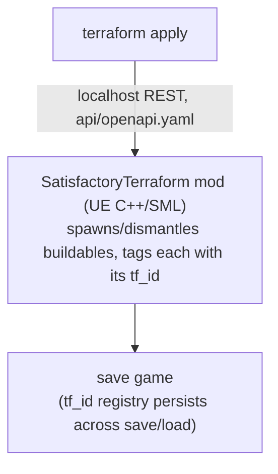

# terraform-provider-satisfactory

[](https://github.com/daroco/terraform-provider-satisfactory/actions/workflows/provider-ci.yml)
[](https://goreportcard.com/report/github.com/daroco/terraform-provider-satisfactory)
[](https://registry.terraform.io/providers/daroco/satisfactory/latest)
[](LICENSE)

Factory-as-code for [Satisfactory](https://www.satisfactorygame.com/): a
Terraform provider plus a companion
[SML](https://ficsit.app/) mod, so `terraform apply` places foundations,
machines, belts and power lines in a **running game**.

```hcl
resource "satisfactory_building" "smelter" {
  class  = "Build_SmelterMk1_C"
  x      = 200
  y      = 0
  z      = 20100
  recipe = "Recipe_IngotIron_C"
}

resource "satisfactory_belt" "ingots" {
  class          = "Build_ConveyorBeltMk1_C"
  from_id        = satisfactory_building.smelter.id
  from_connector = 1
  to_id          = satisfactory_building.constructor.id
  to_connector   = 0
}
```

## How it works



- The provider (`internal/provider`, terraform-plugin-framework) assigns each
  resource a UUID (`tf_id`) and stores it in state.
- The mod keeps a `tf_id → actor` registry that is saved with the game.
  Dismantle something in-game and the next `terraform plan` shows it missing
  and offers to rebuild it. Drift detection, but for factories.
- `internal/mockserver` is an in-memory implementation of the same API so the
  provider is fully developed, tested, and CI-gated without launching the game.

For the whole thing end to end — the request lifecycle, drift detection, the
security gate, and every game-lifecycle subtlety the two halves had to be
built around — see **[docs/design/lifecycle.md](docs/design/lifecycle.md)**.

## Repo layout

| Path | What |
|---|---|
| `api/openapi.yaml` | The mod⇄provider REST contract (source of truth) |
| `internal/provider` | Terraform provider (4 resources) |
| `internal/client`, `internal/api` | API client + shared wire types |
| `internal/mockserver`, `cmd/mockserver` | In-memory mock of the mod API |
| `internal/export`, `cmd/satisfactory-export` | Turns a live region into shareable HCL |
| `examples/factory-hub` | Hub-and-spoke layout (merger/splitter star topology) |
| `examples/iron-plate-line` | Minimal working example config |
| `examples/factory-floor` | Range/grid placement example (`modules/grid-2d`) |

## Resources

- `satisfactory_foundation` — passive structural buildables; any change replaces
- `satisfactory_building` — machines; `recipe` and `clock_speed` update in place
- `satisfactory_belt` — conveyor between two factory connectors
- `satisfactory_power_line` — wire between two power connectors

`class`/`recipe` attributes take the game's own class names
(`Build_ConstructorMk1_C`, `Recipe_IronPlate_C`, ...). They are validated by
the live game at apply time, not baked into the provider — new game content
works without a provider release. Class names are enumerated in the game's own
`CommunityResources/Docs/` JSON and on the wikis.

## Using the provider

You need two things: this provider, and a running game (or dedicated server)
with the companion [SatisfactoryTerraform](https://github.com/daroco/SatisfactoryTerraform)
mod loaded and its localhost API reachable.

Once the provider is published to the Terraform Registry, declare it and run
`terraform init`:

```hcl
terraform {
  required_providers {
    satisfactory = {
      source  = "daroco/satisfactory"
      version = "~> 0.1"
    }
  }
}

provider "satisfactory" {
  # endpoint defaults to http://localhost:8090 (or SATISFACTORY_ENDPOINT).
  # A token is only needed for non-loopback deployments; set SATISFACTORY_TOKEN.
}
```

Before the first registry release, build the provider from source and point
Terraform at it with `dev_overrides` — see [Developing without the game](#developing-without-the-game),
which also lets you try everything against the in-memory mock with no game
installed.

## Placing a range of buildings

Instead of hand-placing every coordinate, use the `grid-2d` module to tile a
bounding box:

```hcl
module "floor" {
  source  = "./modules/grid-2d"
  from    = { x = 0, y = 0 }
  to      = { x = 3200, y = 1600 }
  spacing = 800 # one Build_Foundation_8x4_01_C tile
}

resource "satisfactory_foundation" "floor" {
  for_each = module.floor.positions
  class    = "Build_Foundation_8x4_01_C"
  x        = each.value.x
  y        = each.value.y
  z        = local.base_z
}
```

The same module spaces out repeated buildings too — pass a wider `spacing`
and feed the output into `satisfactory_building` instead. It's pure HCL (no
provider changes): `for`/`range()` compute the grid, `for_each` with stable
`"ix_iy"` keys keeps unrelated cells from being replaced when the bounding
box changes later. See `modules/grid-2d/README.md` and
`examples/factory-floor` for the full pattern, including why it's
`for_each`-shaped rather than `count`-shaped.

`spacing` is yours to choose, but you no longer have to guess it. The
`satisfactory_buildable_class` data source reports a class's real footprint,
read from the game without placing anything:

```hcl
data "satisfactory_buildable_class" "tile" {
  class = "Build_Foundation_8x1_01_C"
}

module "floor" {
  source  = "./modules/grid-2d"
  from    = { x = 0, y = 0 }
  to      = { x = 3200, y = 1600 }
  spacing = data.satisfactory_buildable_class.tile.size.x # 800, from the game
}
```

`size` is null for a class that declares no clearance — most buildables reserve
no space, and a config that depends on a size will fail loudly rather than
silently stack things. The provider does not enforce clearance: placing through
the API deliberately bypasses the game's placement rules, so overlapping is
allowed and this data is advisory.

## Exporting what you built by hand

Building in-game is faster than writing HCL, and most factories start that
way. `satisfactory-export` reads a region of a running world and writes it out
as configuration:

```sh
go build -o satisfactory-export ./cmd/satisfactory-export

# Stand where you want the export centred, then:
./satisfactory-export -at-player -radius 5000 -out blueprint.tf
```

The output is a blueprint, not a recording: every position is an offset from a
`var.origin`, so the same file rebuilds the factory anywhere.

```sh
terraform apply -var 'origin={x=50000,y=50000,z=20000}'
```

Two things it will tell you rather than guess about:

- **Belts and power lines are listed, not exported.** They are defined by which
  connectors they join, and that graph is not part of world enumeration yet. A
  belt emitted from its position alone would apply cleanly and build a factory
  that does not run, so the generator leaves it out and names it in a comment.
- **Buildables Terraform already manages are reported separately**, because
  exporting one of those and applying it elsewhere builds a *second* copy. There
  is no adoption path yet - `terraform import` for hand-built things needs the
  mod to assign tf_ids to buildables it did not place.

To try it without the game, seed the mock with a small hand-built factory:

```sh
go run ./cmd/mockserver -seed &
./satisfactory-export -at-player -radius 5000
```

## Developing without the game

```sh
go run ./cmd/mockserver &                 # fake world on :8090
go build -o /tmp/terraform-provider-satisfactory .

cat > /tmp/dev.tfrc <<EOF
provider_installation {
  dev_overrides { "daroco/satisfactory" = "/tmp" }
  direct {}
}
EOF

cd examples/iron-plate-line
TF_CLI_CONFIG_FILE=/tmp/dev.tfrc terraform apply
```

Tests: `go test ./...`; full acceptance run: `TF_ACC=1 go test ./internal/provider/ -v`.

## CI

- **provider-ci** (hosted runners): build, vet, unit + acceptance tests against
  the mock, and an apply/plan/destroy of every example.

The companion in-game mod (UE C++/SML) lives at
[daroco/SatisfactoryTerraform](https://github.com/daroco/SatisfactoryTerraform),
including its own build CI and self-hosted-runner setup docs.

## Where this can go: the GitOps factory

Because state lives in Terraform and mutations go through a reviewable plan,
some genuinely unhinged things fall out almost for free once M2/M3 land
(design notes in [docs/design/gitops-factory.md](docs/design/gitops-factory.md)):

- **The repo is the world** — a dedicated server runs the mod; CI applies
  `main` on merge. The factory is the branch.
- **PRs are governance** — `terraform plan` output posted as a PR comment is
  the review artifact: "adds 4 smelters, rewires belt 12, dismantles nothing."
  CODEOWNERS on `factories/nuclear/`.
- **Twitch-plays mode is a merge policy** — chat votes, the winning PR merges,
  viewers watch the buildings materialize. Griefing is drift; `terraform apply`
  is disaster recovery.
- **Rollbacks are `git revert`** — cursed spaghetti build merged? Revert the
  commit and it un-exists.

## Status

All 4 resources are functionally complete and verified live end-to-end
against a running game session: full applies, in-place recipe/clock updates,
drift detection, and zero-drift plans that survive save/reload. Provider CI
gates every change against the in-memory mock.

Next up: Terraform Registry release (GoReleaser + docs generation + signing),
`terraform import` polish, and GitOps mode.

License: [MPL-2.0](LICENSE).
