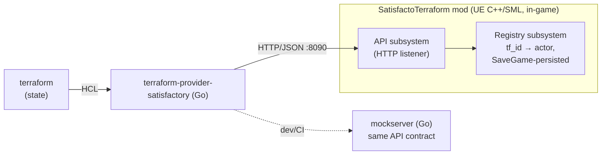

# Architecture

## The contract

`api/openapi.yaml` is the single source of truth. Four implementations must
stay in lockstep — change the spec first, then all of:

1. `internal/api` (wire types)
2. `internal/client` (provider's HTTP client)
3. `internal/mockserver` (in-memory reference implementation + validation)
4. `Source/...` in the [SatisfactoryTerraform mod repo](https://github.com/daroco/SatisfactoryTerraform) (the real implementation, C++)

Error semantics: `404` unknown `tf_id`, `409` duplicate `tf_id`, `422`
validation failure (unknown class, bad connector, clock out of range).
Writes are synchronous: the mod answers once the change is applied on the
game thread.

## Identity and drift

- The provider generates a UUID per resource (`tf_id`) at create and stores it
  in Terraform state; it is the only identity. Position/class are attributes,
  never identity.
- The mod's registry subsystem maps `tf_id → actor` and is persisted via the
  save-game interface, so identity survives save/load and server restarts.
- Read path: `GET /buildables/{tf_id}`. A dismantled-in-game actor resolves to
  nothing → 404 → the provider removes it from state → the next plan proposes
  recreation. Griefing is drift; `terraform apply` is disaster recovery.
- Import: `terraform import satisfactory_building.x <tf_id>` (passthrough ID).

## Update semantics

| Attribute | Behaviour |
|---|---|
| `recipe`, `clock_speed` (building) | in-place `PATCH` |
| everything else (class, transform, connectors, endpoints) | `RequiresReplace` |

Rationale: the game can retool a machine in place, but moving/reclassing a
buildable is a dismantle+rebuild in-world anyway, so the provider models it
honestly.

## Threading model (mod)

UE's `FHttpServerModule` dispatches route handlers on the game thread during
its tick, and world mutations happen inline in the handlers. All mutation
goes through single helpers (`SpawnBuildable` / `SpawnConnection`) so
ordering is explicit and the code stays correct if the listener ever moves
off-thread. The API subsystem spawns only where there is authority
(host / dedicated server).

## Why class names are opaque strings

The provider never ships game-content tables. `Build_*_C` / `Recipe_*_C`
names are validated by the live game at apply time, so new game content works
with zero provider releases. The game itself ships a machine-readable content
dump (`CommunityResources/Docs/`) — a future `go generate` step can derive
optional client-side validation/autocomplete tables from it, but the mod's
answer remains authoritative.

## Trust boundary

Default posture is localhost, single player, optional bearer token. For any
shared/public deployment (see `gitops-factory.md`): set the token, and treat
the API as root access to the world — it can spawn and destroy anything.
