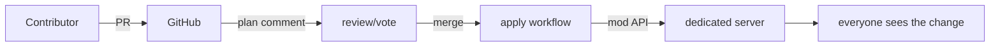

# The GitOps factory (design notes)

Not built yet — this documents where the architecture deliberately leaves the
door open. Prerequisites: M2/M3 (mod compiles; belts/power work) and token
auth enforced.

## The idea

A Satisfactory dedicated server whose world is governed by a Git repo.
Nobody builds by hand; the factory is whatever `main` says it is.

## Mechanics that already exist

- **State + plan**: Terraform state describes the intended factory; `plan`
  output is a human-readable diff ("4 smelters added, belt 12 rewired,
  nothing dismantled") — a perfect PR review artifact.
- **Drift as gameplay**: players (or griefers) dismantling managed buildings
  shows up on the next plan as missing resources. Reconciliation rebuilds
  them. Unmanaged hand-built stuff is invisible to Terraform and coexists
  fine.
- **Rollback**: `git revert` + apply. Cursed builds un-exist.

## Pieces to build

1. **Server deployment**: dedicated server (Linux, container) with the mod
   installed; mod API bound to localhost or a private network, token set.
   The official Dedicated Server API handles session/save management; our
   mod handles construction.
2. **Apply pipeline**: workflow on merge to `main` → `terraform apply`
   against the server. State in a real backend (S3/GCS/TF Cloud), never in
   the repo.
3. **Plan-on-PR**: workflow posts `terraform plan` as a PR comment.
   Guardrails: plan runs read-only; fork PRs get plan-only with no
   credentials (or no run at all — see security).
4. **Governance layer** (pick one per community):
   - maintainer review + CODEOWNERS per factory area (`factories/nuclear/`)
   - vote-to-merge bot (reactions/majority within a window)
   - twitch-plays: chat votes between competing PRs; winner merges on a
     timer; stream shows the apply happening live
5. **Namespacing**: one root module per factory district; state locking
   serializes applies so two merged PRs can't fight over the same world.

## Security posture (non-negotiable for public mode)

- The mod API is root access to the world: token required, never exposed to
  the public internet raw (private network / tunnel between CI and server).
- Apply credentials live only in the apply workflow on `main`; PR workflows
  never see them.
- Self-hosted anything (runner, server) never executes fork-PR workflows.
- Rate-limit merges (timer/queue) so the server isn't thrashed by applies.

## Open questions

- Collision policy: Terraform happily specifies overlapping buildings; the
  game will reject or clip. Validate in the mod (422 on overlap) vs. let the
  world be weird? Leaning: validate hard in public mode.
- Who owns hand-built structures near managed ones — protection zones?
- Resource costs: spawning for free is creative-mode energy. Public servers
  may want the mod to debit a shared inventory (this is a mod-side feature,
  the API contract already carries the class info needed to price builds).
