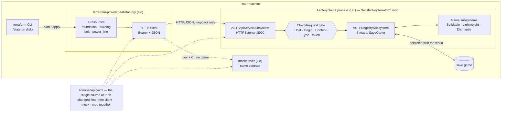
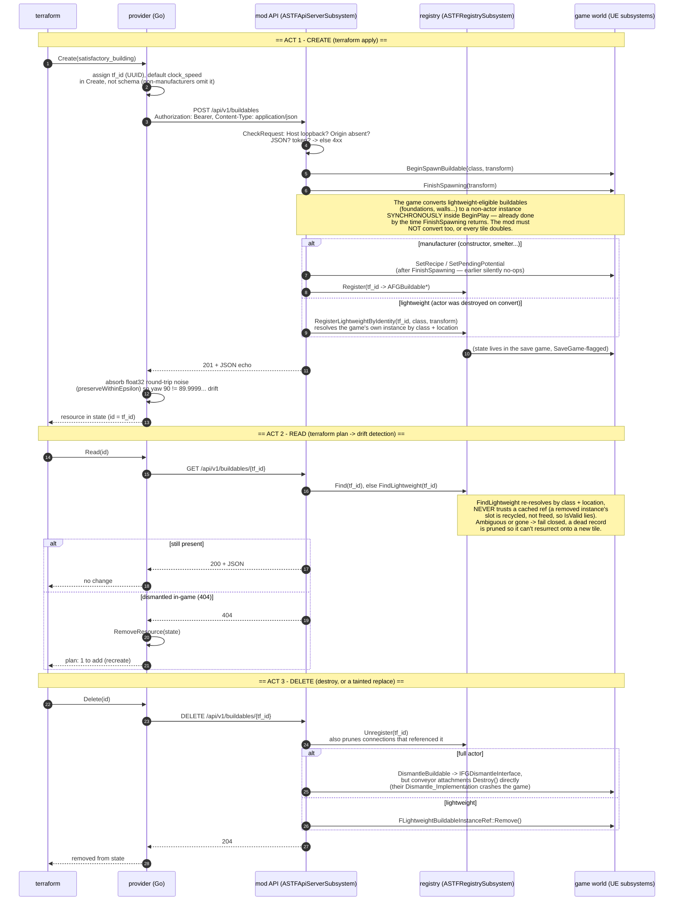
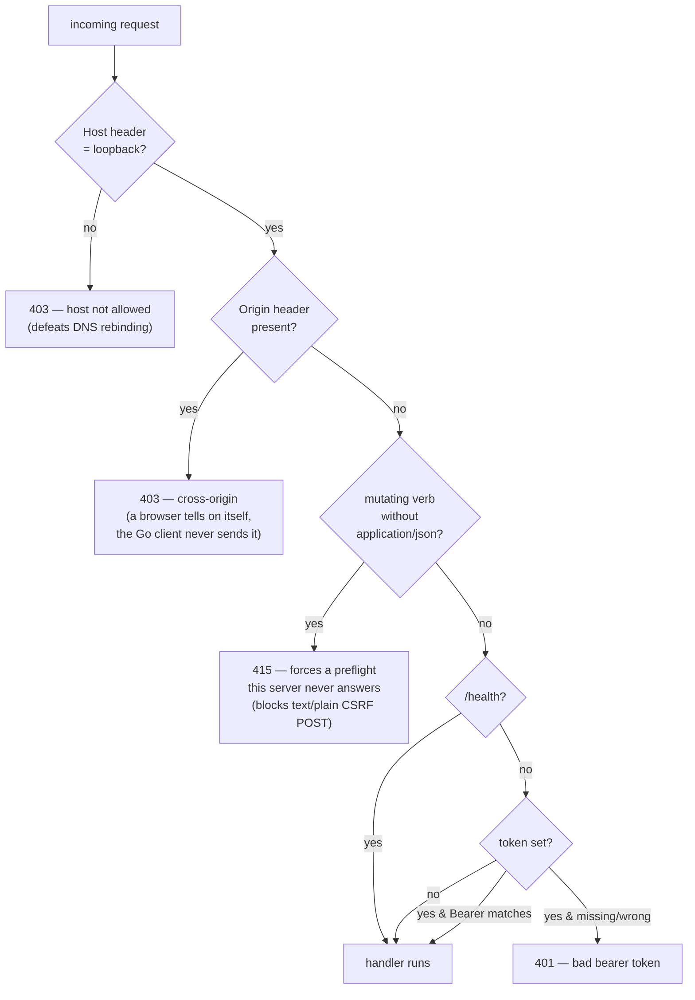

# The full lifecycle: provider → mod → game world

This is the whole system end to end — how a line of HCL becomes a building in
a running game, how in-game changes come back as Terraform drift, and where
every hard-won subtlety lives. Names are exact so the diagrams double as a map
of the code. The provider is in this repo; the mod (`ASTFApiServerSubsystem`,
`ASTFRegistrySubsystem`) is in
[daroco/SatisfactoryTerraform](https://github.com/daroco/SatisfactoryTerraform).

## System at a glance

The contract (`api/openapi.yaml`) is the pivot: the Go client, the in-memory
mock, and the C++ mod are three implementations of it that must stay in
lockstep. The mock is why the whole provider can be built and CI-gated without
launching the game — and, this project having learned it the hard way, why the
mock *can't* catch bugs that only exist in the real game's object lifecycle.

## A request, end to end

One sequence, three acts: **create** (apply), **read** (plan / drift), and
**delete** (destroy or in-game dismantle). The notes mark the places where the
obvious implementation was wrong and the code does something specific instead.

### Connections are a fourth act

Belts and power lines (`POST /api/v1/connections`) spawn through the same
spline strategy the game's own placement uses, then are wired **into** the
chain — `source output → GetConnection0()` (belt input),
`GetConnection1()` (belt output) `→ destination input`, verified from both
ends. An earlier version wired the two machine connectors straight together
and left the belt dangling: items still moved, but the impossible
connector-to-connector state crashed the game on dismantle. The connection's
endpoints are recorded in a third registry map so the list endpoints can tell
a belt apart from a plain buildable.

## The security gate

Every request passes `CheckRequest` (or `CheckTransport` alone, for
`/health`) before its handler runs. The layers exist because the port is a
control plane — it can build and dismantle anything — and each stops a
different attacker.

Underneath all of that, the listener is pinned to `127.0.0.1` in `BeginPlay`
before it is created — FactoryGame overrides UE's `localhost` default to
`any`, so without the pin this binds to `0.0.0.0` and the gate above would be
the only thing between your factory and the LAN.

Loopback bind blocks the network entirely; Host + Origin + Content-Type block a
malicious web page (including via DNS rebinding); the optional bearer token
(`SATISFACTORY_TOKEN`, read from the environment at launch) is defense-in-depth
locally and the only guard for a tunnel forwarded to the loopback port.

## Why the mock can't find these

Nearly every subtlety the notes above call out — synchronous lightweight
conversion in `BeginPlay`, recycled instance slots, the conveyor-attachment
dismantle crash, the impossible connector state, float32 transform noise — is a
property of the *real game's* object lifecycle. The Go mockserver implements the
same wire contract faithfully and gates CI, but it models none of that runtime
behavior, so each of these was found only by driving the API against a running
game and watching the world. That live-verification loop is not a phase of the
project; it is the test suite for everything downstream of the HTTP boundary.
